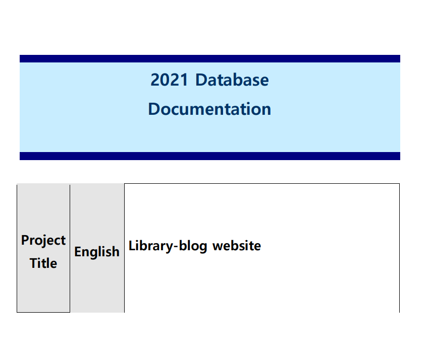

# Overview

The implementation of my program divided into two categories. First categories, where the
back-end I made in Django by using ORM and second I translates my ORM implementation
in SQL tables and insertion I used for a person who is aware of SQL, but have not idea about
Django. During this course I understood a lot of materials and understood that using knowledge
from database and sql, I can try other database and that is why I used sqlite3, because it is
simple and not for big projects. I made a blog-library where members can create, read, update,
delete the discussion about a book and other can comment, like and view a book, but they need
to login first. Most of my logic is made in python such as creating tables, making queries.
Inserting new records in database is done by using Django framework which has an ORM,
which interacts with database by using python script. Currently the website works from my PC
with the address 127.0.0.01 is the standard address for IPv4. I have two sql files, they are for
the viewer who is trying to understand what kinds of tables I added to my database and
insertion.sql is for values that I added to my database.

# Run the program

First of all, to run the website, we need to install the interpreter of python 3.6 in the official
website https://python.org/, then we need to install the framework that can be easily installed
by using CMD. And run the command ‘pip install django’
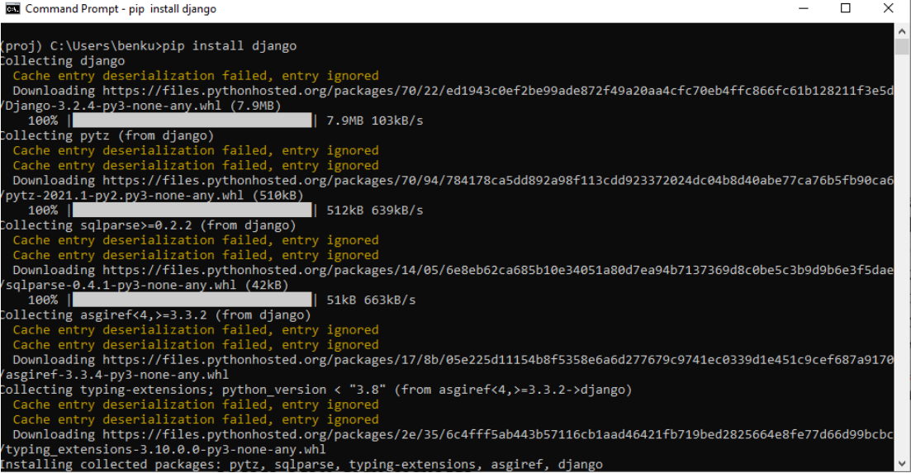

next, we need to get into folder of our project and run inside this project following commands
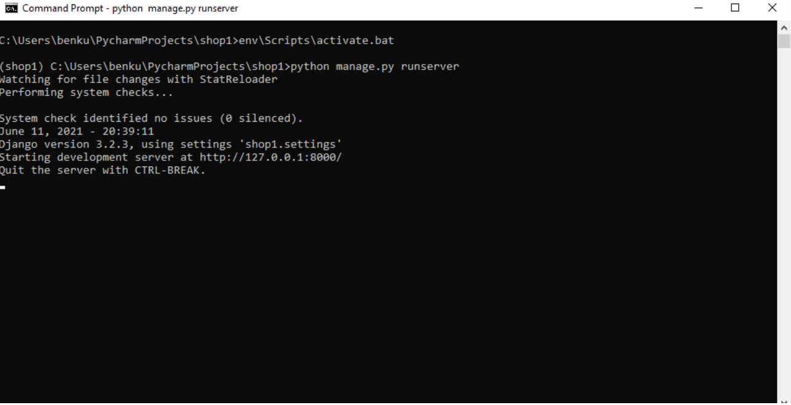
Now we can type in browser and see the website.
[http://127.0.0.1:8000/](http://127.0.0.1:8000/)

For the sake of simplicity, I will add a video demonstration how my program works.

# Implementation

How it was written earlier the concept of creating tables was derived from SQL
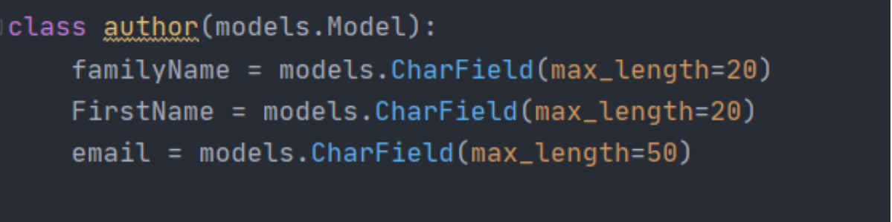
One code is written in Python and another code in sql. As you can see the syntax is the same
and the logic also.
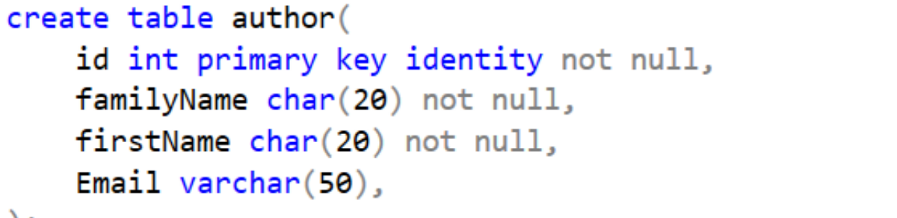
# Admin Panel

We can either add values with insertion.sql in SQL SERVER or with using sqlitie3 using
database and webpage. However, the main difference between both of them is simplicity in
viewing tables as well as insertion new values because of the Html, css, javascripts. I created a
super user or admin panel, and if we login as a super user we will have an access to the all
tables and values and we have all rights to do what we want to do.

To open an admin panel, we need to write following numbers in search bar
**_127.0.0.1:8000/admin_**
and login as an admin that I created.

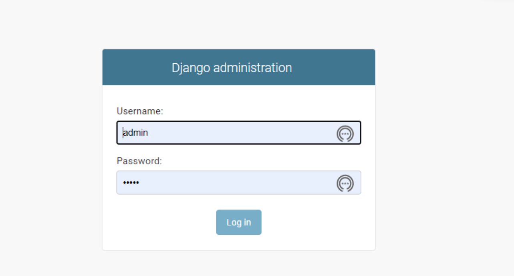
_Username_ **:admin**
_Password_ **:admin**
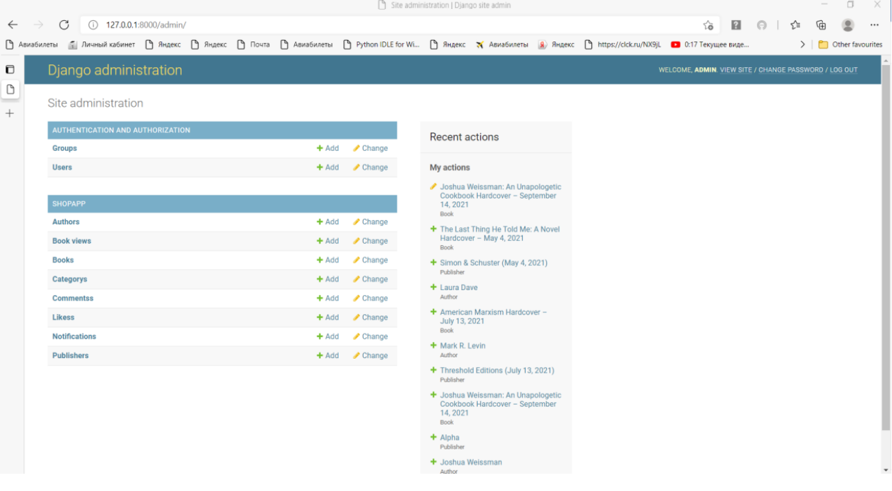
!
After login as admin, we will have an access to all database and records inside tables. As you
can see, we have 10 tables, but we should take into consideration ‘Group’ table, because it is
provided by default. If we want to access Author table, we just click and we can see all the
values that are inserted.

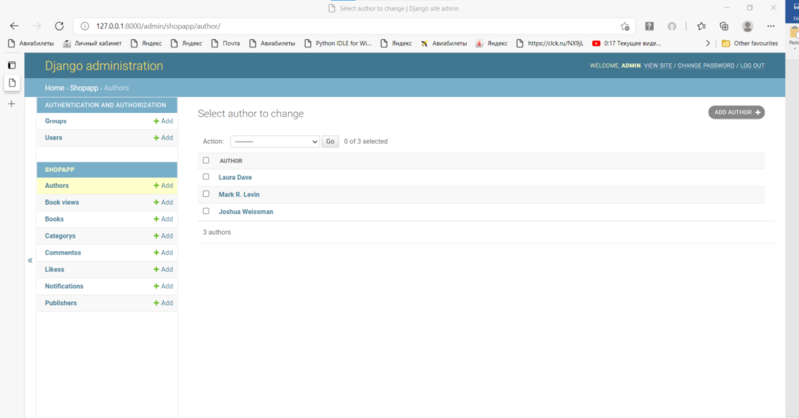
# Registration

Registrations is needed to create a discussion forms, leave comments and more if a user is not
authenticated he is not able to add values in tables.
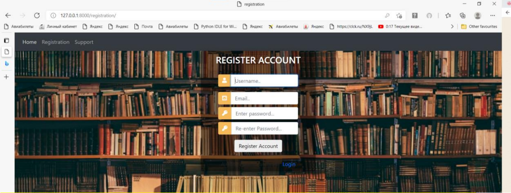
After filling the form, ‘user’ will be redirected to a login page, where ‘user’ can sign in.

# Home page

In the main page or home page we can see a list of books that are stored in our database. We
can see in the left top corner (‘Create’) it is a link to the new page, where we can add a book
description in ‘book’ table and (‘Support’) is for connecting with administrators or staff
members that are privileged to see message in Support tables in the (admin panel)
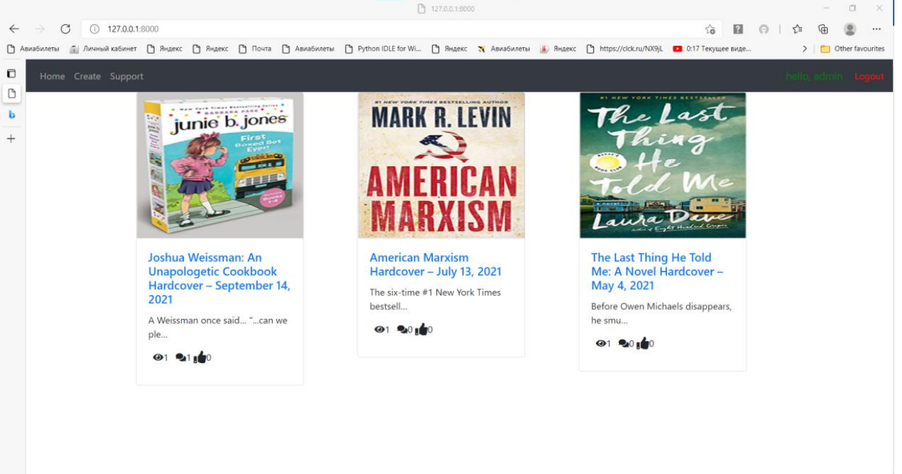
# Book Detail

If we want to know more about certain book and comments of a book, we can view it
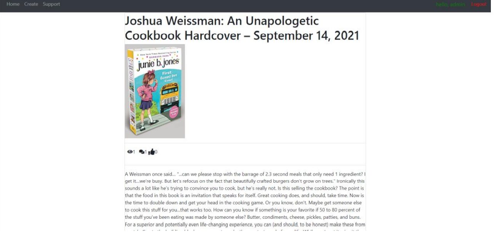
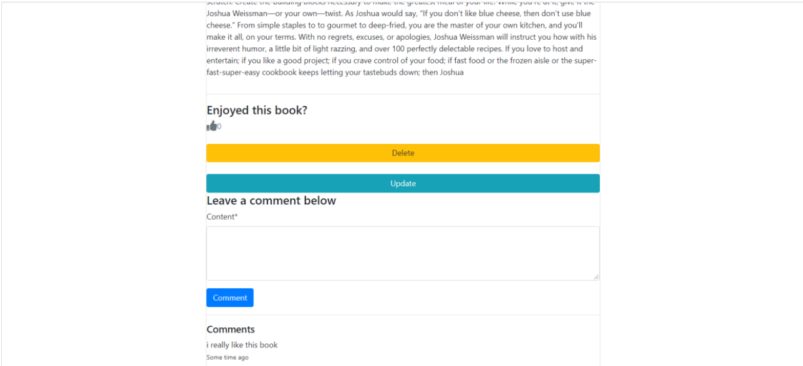
As we already login, we can update, delete a record from a table, but if we log out we do not
have rights.

# Icons

Overall we have three icons in each book and every icon has their own functionality.
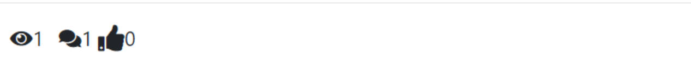

If we click in the same book every time, the ‘eye icon’ increases by one, but only with every
new user. If we clicked sever times in book with the same user, ‘eye icon’ increases by one and
do not go further, but if login as an another ‘user’ and click the book, the ‘eye icon’ will increase
by one. ‘Comment icon’ increases by one every times we add a new comment and ‘like’ also
adds every time when we like a post with the same user. In brief, the functionality is pretty
much the same as we can see in other websites.

# Create/Update Form

When we want to add new values in book table, we can do it with special pages.

